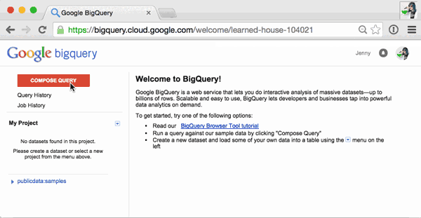

# BigQuery queries as presented at Code on the Beach 2015

I had a blast at [Code on the Beach 2015](https://www.codeonthebeach.com/), and some of you asked me to share the queries I ran during [my presentation](https://www.codeonthebeach.com/cotb2015/session/3109/what-we-know-what-is-happening-and-what-we-are-made-of-exploring-big-data-on-the-cloud). Here they are!

## How to use these queries

All of these queries use publicly accessible data sets hosted on Google BigQuery. 

To run them for yourself, follow these steps:

0. Go to [https://bigquery.cloud.google.com](https://bigquery.cloud.google.com).
0. If you're new to Google Cloud Platform, create your first project. This may take you to the Google Developer Console. If so, return to [https://bigquery.cloud.google.com](https://bigquery.cloud.google.com).
0. Click 'Compose Query', paste the query in, and run it.

## About Usage
You get [1TB of free query usage](https://cloud.google.com/bigquery/pricing#queries) per month on BigQuery. Because I was trying to demonstrate how well BigQuery scales, some of these example queries use a lot more than that.
